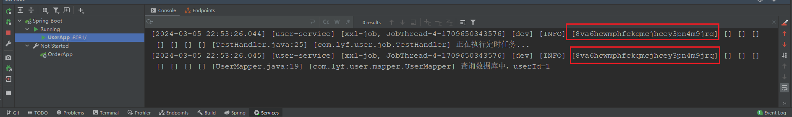

# mytool

## 1. 介绍
通用工具包，包含统一日志注解，统一异步注解，全链路追踪等。

涉及技术：SpringBoot, SpringCloud, OpenFeign, XXL-JOB, RocketMQ，ThreadLocal等。


## 2. 使用说明

1.  导入Jar包

```
<dependency>
    <groupId>com.acjava</groupId>
    <artifactId>mytool-boot-starter</artifactId>
</dependency>
```

2.  在需要使用日志或异步的方法上面，添加 `@MyLog` 或 `@MyAsync` 注解即可。

同时代码里可随意使用 `log.info()` 和 `log.error()` 等日志记录，这些记录都将携带 traceId

## 3. 示例
1. 演示普通跨服务调用


2. 演示 MQ


3. 演示 XXL_JOB




> 测试代码地址：[cloud-test](https://gitee.com/liu_yuefeng/cloud-test)

## 4. 可配置参数


```

# 是否使用 @MyLog 日志注解，默认值为 true
mytool.my-log.enabled=true

# 是否开启全链路追踪，默认值为 true
mytool.trace.enabled=true

# 是否使用 @MyAsync 异步注解，默认值为 true
mytool.my-async.enabled=true

# 配置 @MyAsync 的线程池参数
mytool.my-async.default-pool.cpuCore=4
mytool.my-async.default-pool.corePoolSize=8
mytool.my-async.default-pool.maxPoolSize=16
mytool.my-async.default-pool.keepAliveSeconds=180
mytool.my-async.default-pool.queueCapacity=500
mytool.my-async.default-pool.awaitTerminationSeconds=60
mytool.my-async.default-pool.threadNamePrefix=mytool-default-pool-

```


